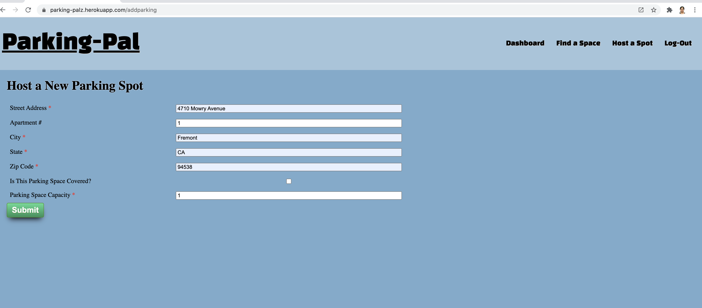
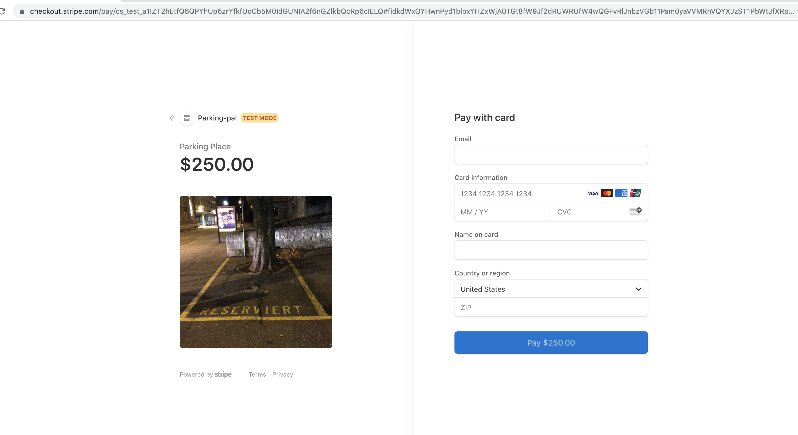

# parking-pal

ParkingPal connects Providers who want to rent their parking spaces to Consumers who are looking for spaces near their location. When logged into the app, a user can both provide their parking spots or rent out a spot from another user.

When providing a space, a user can add their parking space details, prices and date(s) available. When looking for a space to rent, a user can search for parking by location, and make a reservation to rent a space via stripe transaction.


### Technology 
- MVC (Model View Controller) pattern 
- React Application with 
    - Context API
    - Graph QL API
    - SCSS
    - JavaScript
    - Mongoose
    - MongoDB
    - Node.JS
    - bcrypt
    - Express
- Lucid for basic database design / wireframes / project tasks
- Stripe Trasanction for payments


### Installation

To install dependencies, run the following command from the root directory of this project: 

```npm install```

You will need Node.js and MongoDB installed on your machine to run Parking-Pal locally.


### Project Deployment / GitHub Details

To clone the project:

- SSH - git@github.com:the-glorious-4/parking-pal.git
- HTTPS - https://github.com/the-glorious-4/parking-pal.git
 
Project Source code : https://github.com/the-glorious-4/parking-pal

This project is also deployed to Heroku, a cloud platform service where users can deploy their projects:
- Heroku URL  http://parking-palz.herokuapp.com/


### Images

Home Page


Login 


Host a Spot



Add Inventory


Make Reservation


Checkout and Payment.



### Questions

If you have any additional questions about the repo, open an issue or contact us directly at abby.parkinglot@gmail.com
